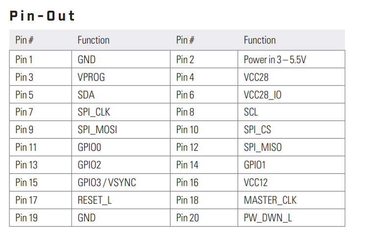
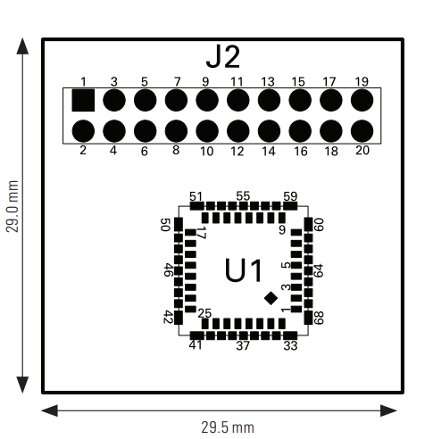

# FLIR Lepton 3.1R
- Infrarød bildesensor
- Kameraet styres over I2C
- Bildet overføres via SPI
- Oppløsning 160 x 120 pixler

### PINOUT-FLIR Lepton 3.1R

Pin 1 - SCL: Camera Control Interface Clock, I2C
Pin 2 - SDA: Camera Control Interface Data, I2C
Pin 3 - VIN: 3-5 V Supply input
Pin 4 - GND: Common Ground
Pin 5 - CLK: Video Over SPI Slave Clock
Pin 6 - MISO: Video Over SPI Slave Master In Slave Out
Pin 7 - MOSI: Video Over SPI Slave Master Out Slave In
Pin 8 - CS: Video Over SPI Slave Chip Select (active LOW)
Pin 9 - VSYNC: VSync
Pin 10 - EN: Enable, Active High

### Eksempelkode:
https://github.com/groupgets/LeptonModule/blob/master/software/arduino_i2c/Lepton.ino
https://www.youtube.com/watch?v=NLrTN8MurZw

### Firmware:
https://github.com/meshtastic/firmware/tree/develop/variants/esp32s3

## PureThermal Breakout Board:

Docs: https://mm.digikey.com/Volume0/opasdata/d220001/medias/docus/694/250-0577-00_DS_1-2021.pdf

### Pinout breakout board

