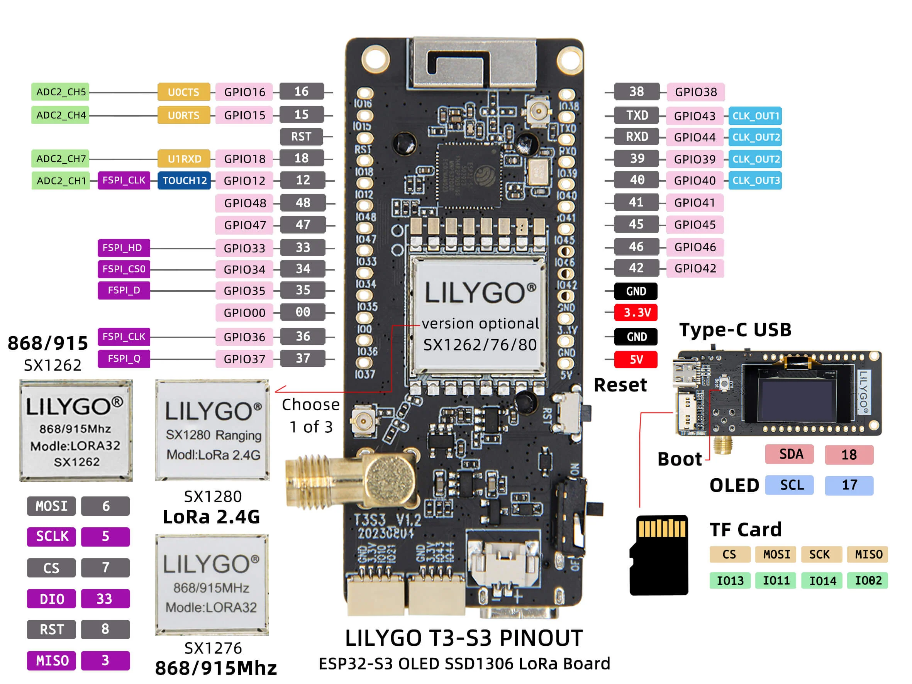

# Lilygo T3S3

Docs: https://lilygo.cc/products/t3s3-v1-0?srsltid=AfmBOopp3JhhNC7khOD7I2lo4_tuQ7JHq4zn1pFwLn2LteZeAK3_Wx3Q

## Pinout

- Basert på pinout ser det ut til at I2C er opptatt av skjermen
- SPI er opptatt av SDkortet 
- Dette gjør at det eneste vi har ledig til wired kommunikasjon er RXD og TXD (UART)
- Det betyr at vi basicly må ha en MCU til 
