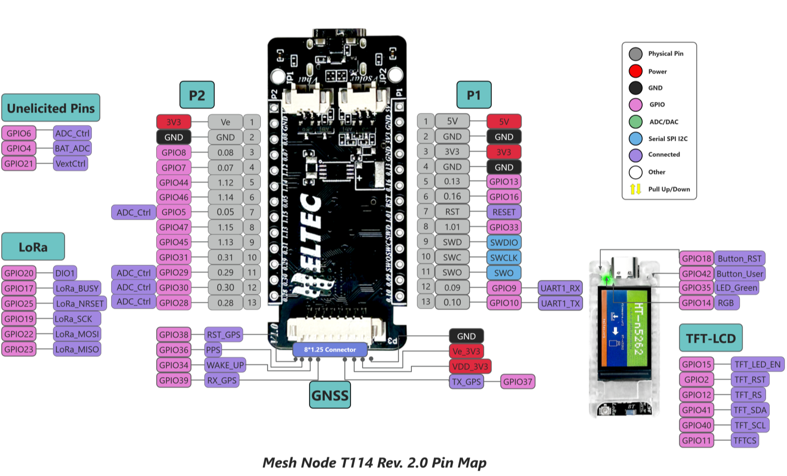

# Heltec mesh node t114

Docs: https://heltec.org/project/mesh-node-t114/

## Pinout:

| Hardware Resource  |  USB 2.0, 4 * SPI, 2 * TWI, 2 * UART, 4 * PWM, QPSI, 12S, PDM, QDEC Etc. |
|---|---|
| MCU  | nRF52840 |