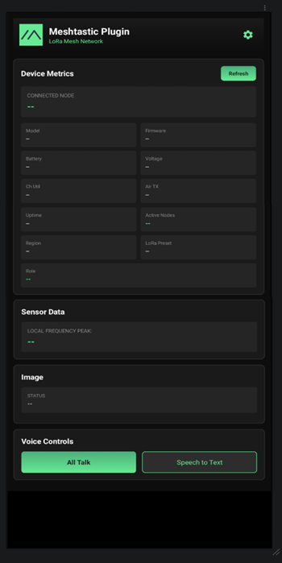

# Meshtastic ATAK Plugin

Versjon av Meshtastic plugin klonet fra [niccellular](https://github.com/meshtastic/ATAK-Plugin). Den fungerer i utgangspunktet ganske likt som den originale versjonen, med noen ekstra funksjonaliteter. Denne versjonen har funksjonalitet for å kunne motta sensordata fra en RTL-SDR og bilder i formatet .webp. 

NB! Pluginen er ikke signert av tak.gov og fungerer kun på developer builden av ATAK-CIV!

# Plugin i bruk:



## dependencies: 

- JDK 17
- Gradle 8.13
- Kotlin 2.0.21
- Groovy 3.0.22
- ATAK-CIV SDK 5.6.+ 
- Meshtastic 2.7.13

## Nyttig informasjon:

PLUGIN-ID = 'atak-takdev-plugin'

### kommandoer 

Bygg:
```bash
./gradlew assembleCivRelease
```

Installer:
```bash
adb install "path_til_.apk"
```

### Docs:

- [User guide](https://drive.google.com/file/d/1bo9WHadg3J3o55OLlx1mn3McqEJzvgrK/view)
